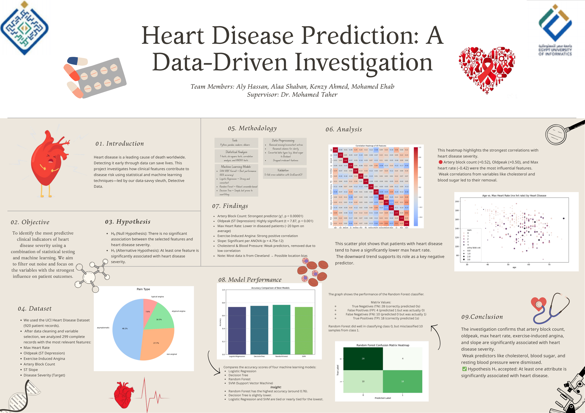

# Heart Disease Prediction: A Data-Driven Investigation

## Overview
This project investigates clinical and demographic factors that contribute to heart disease using data science and machine learning techniques. Inspired by a detective story theme, we transformed the UCI Heart Disease dataset into an actionable medical analysis, uncovering key predictors of cardiovascular risk.

## Dataset
Original dataset sourced from Kaggle:  
🔗 [UCI Heart Disease Dataset on Kaggle](https://www.kaggle.com/code/redwankarimsony/uci-heart-disease-eda-classification-analysis/notebook?scriptVersionId=43430838)

## Contents
- 📘 **Report_Version_2.pdf** – Full narrative report with data cleaning, analysis, visualizations, and findings.
- 🧠 **SRC.ipynb** – Jupyter Notebook with full pipeline (EDA, preprocessing, ML).
- 📍 **poster.png/pdf** – Visual summary of the entire project.

## Key Features
- Cleaned 920-row UCI dataset down to 299 usable records.
- Statistical analysis with chi-squared tests, t-tests, ANOVA, and correlation heatmaps.
- Feature engineering and selection based on correlation and significance.
- Machine learning models evaluated: Logistic Regression (best, 0.79 accuracy), Decision Tree, Random Forest, SVM.
- Strong predictors: artery block count, oldpeak (ST depression), max heart rate, exercise-induced angina, slope.

## Machine Learning Results
| Model              | Accuracy | Precision | Recall | F1-Score |
|-------------------|----------|-----------|--------|----------|
| Logistic Regression | 0.79     | 0.82      | 0.74   | 0.78     |
| Decision Tree      | 0.75     | 0.79      | 0.71   | 0.75     |
| Random Forest      | 0.75     | 0.81      | 0.68   | 0.74     |
| SVM (RBF Kernel)   | 0.75     | 0.77      | 0.74   | 0.75     |

## How to Run
1. Clone the repository.
2. Open `Heart_Disease_Prediction.ipynb` in Jupyter or Google Colab.
3. Load the dataset from the source mentioned above.
4. Run each cell step-by-step to follow data preprocessing, analysis, and model training.
5. View the report and poster for a detailed narrative and visuals.

## Future Work
- Incorporate larger and more diverse datasets to reduce regional bias.
- Integrate deep learning models for multiclass severity prediction.
- Include more medical variables (e.g., genetic markers, lifestyle factors).

## Authors
- Aly Hassan  
- Alaa Abdelaziz  
- Mohamed Ehab  
- Kenzy Zedan  
(Data Analysis – C-DE211, under Dr. Mohamed Taher)

## License
MIT License (optional – include if you want open-source sharing).
